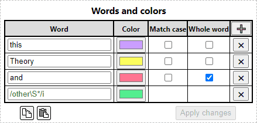
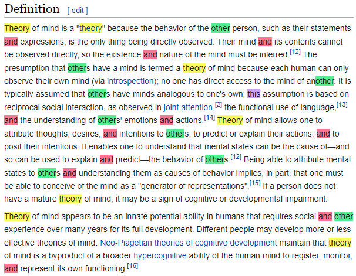

# Multi-Highlight
Chrome extension. Highlights the words specified in the settings in different colors.

## 1. Settings

## 2. Result

---
⚠️ Doesn't search for text inside images, vector SVG graphics, and pseudo-elements.